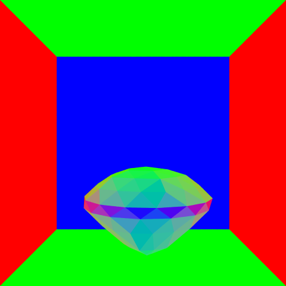
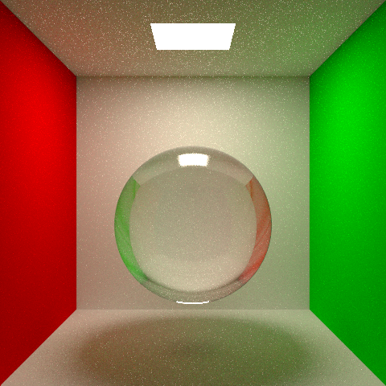
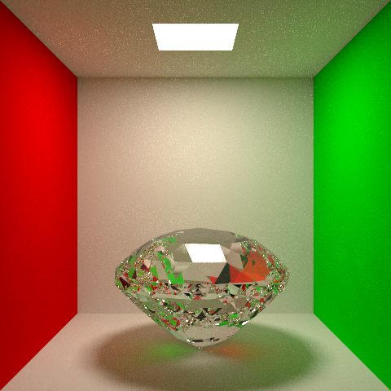

# CSE 168 final project: GemTracer
## Author Name: Pui Tim Cheng

In this final project, I am planning to render a picture of different type of gem stones, which will include the topics of specular transmission, attenuation, andlight dispersion.

Here are some paper that are related to the topics:
1. Production Volume Rendering SIGGRAPH 2017 Course: https://graphics.pixar.com/library/ProductionVolumeRendering/paper.pdf
2. Microfacet Models for Refraction through Rough Surfaces: https://www.cs.cornell.edu/~srm/publications/EGSR07-btdf.pdf
3. Graphics gems revisited: fast and physically-based rendering of gemstones: https://dl.acm.org/doi/10.1145/1015706.1015708

I downloaded a free obj file from cgtrader by author alexmit:
https://www.cgtrader.com/free-3d-models/various/various-models/gem-stones-pack-0c0ca99b-b144-4866-8e34-306999076d06
Here is the gem obj file preview:
  
 

### Part1: getting transmittion and make .obj file compatible
for the first part I have added transmittion to the ray tracer with the help of this [website](http://www.pbr-book.org/3ed-2018/Reflection_Models/Specular_Reflection_and_Transmission.html#fragment-Computeraydirectionforspeculartransmission-0) and added more function to the SceneLoader in order to load the gems vertices data.

I used the Fresnel equation and a random number to decide whether to sample the reflection or refractive part when a surface is hit.
Here are some images:

1)A normal Map for the testing gem1  

2)Using old cornell scene to make sense of my code  

3)output of gem1 in the cornell box  

